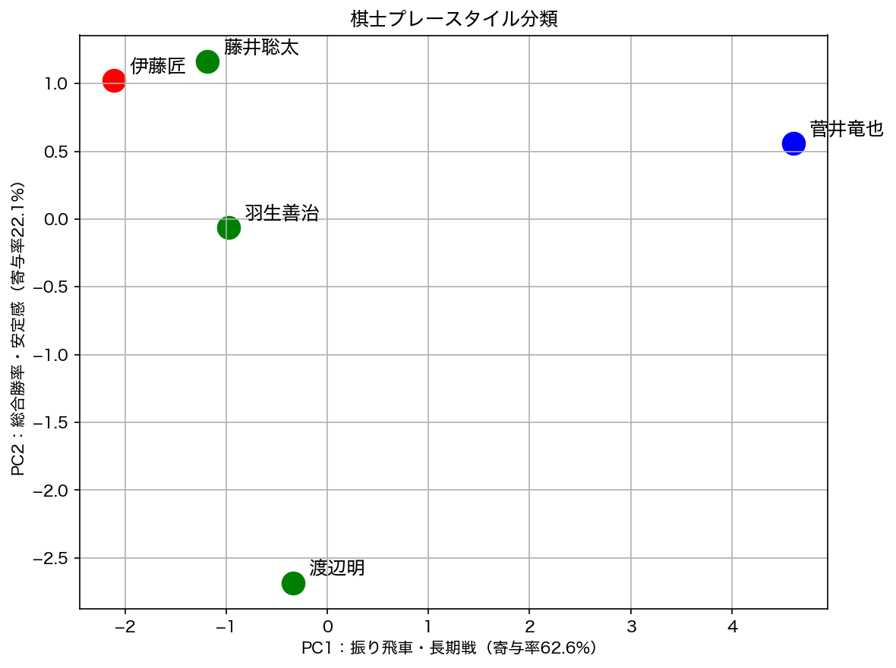
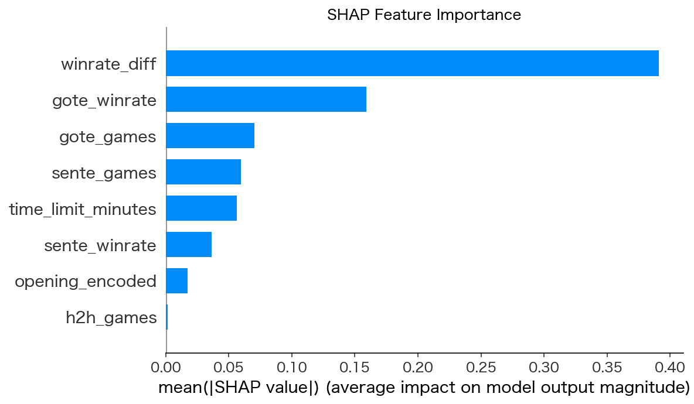

# 将棋データ分析ポートフォリオ

[](https://shogi-playstyle-analysis-6kapg4q6tbcks3qf5xldgw.streamlit.app)

将棋棋士の棋譜データを機械学習で分析する2つのプロジェクト。

## ポートフォリオ一覧

| # | プロジェクト | 手法 | 結果 |
|---|---|---|---|
| ① | [棋士プレースタイル分類](notebook/playercf.ipynb) | k-means / PCA | 3クラスタに分類、PC1寄与率62.6% |
| ② | [将棋勝敗予測モデル](notebook/win_prediction.ipynb) | LightGBM / Optuna / SHAP | AUC=0.781（5-fold CV） |

---

## ① 棋士プレースタイル分類

プロ棋士5名の棋譜データから特徴量を抽出し、k-meansクラスタリングでプレースタイルを自動分類。

**データ**: 将棋DB2・5棋士・各50局  
**特徴量**: 勝率・平均手数・先後手勝率・短期/長期戦率・振り飛車率など9特徴量

**結果**



- **菅井竜也**: 振り飛車率0.90・平均手数120手と長期戦型で独立したクラスタを形成
- **伊藤匠**: 勝率0.74・先手後手ともに安定した高勝率で単独クラスタ
- **藤井聡太・羽生善治・渡辺明**: 居飛車型のオールラウンドクラスタ

---

## ② 将棋勝敗予測モデル

対局前の事前情報のみを特徴量として、先手/後手の勝敗を予測する二値分類モデル。

**データ**: 将棋DB2・9棋士・449局  
**特徴量**: 棋士勝率・実力差・対局数・持ち時間・戦型

**結果**

| モデル | Accuracy | AUC |
|---|---|---|
| LightGBM Baseline | 0.695±0.041 | 0.761±0.030 |
| Optuna Tuned | 0.690±0.047 | **0.781±0.036** |

**SHAP分析**



- `winrate_diff`（実力差）が予測に最も寄与（将棋的直感と一致）
- `time_limit_minutes`（持ち時間）も一定程度影響

---

## 技術スタック

- **データ処理**: cshogi / pandas / numpy
- **機械学習**: scikit-learn / LightGBM / Optuna
- **解釈**: SHAP
- **可視化**: matplotlib

## 実行方法

```bash
git clone https://github.com/nyancyu/shogi-playstyle-analysis.git
cd shogi-playstyle-analysis
python -m venv venv
source venv/bin/activate
pip install cshogi pandas numpy scikit-learn lightgbm optuna shap matplotlib jupyter
jupyter notebook
```

## 注意事項

棋譜データは著作権の関係でリポジトリに含めていません。
将棋DB2より各棋士の棋譜をKIF形式でダウンロードしてください。
