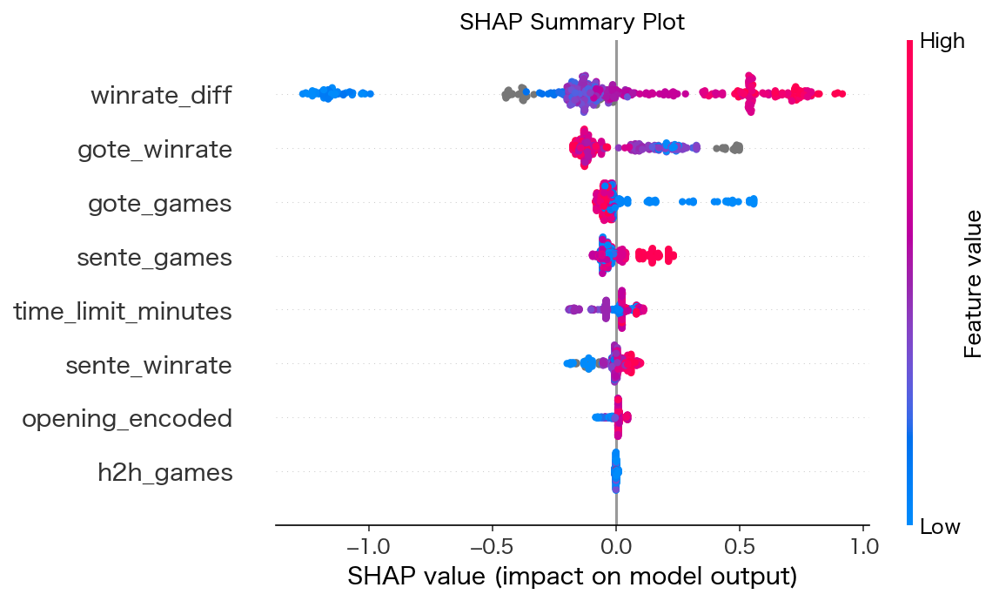

# 将棋勝敗予測モデル

対局前の事前情報のみを特徴量として、LightGBMで先手/後手の勝敗を予測する二値分類モデル。

## プロジェクト概要

| 項目 | 内容 |
|---|---|
| データ | 将棋DB2より取得したKIFファイル（9棋士・449局） |
| タスク | 二値分類（先手勝ち=1 / 後手勝ち=0） |
| 評価指標 | AUC・Accuracy（Stratified 5-fold CV） |
| モデル | LightGBM + Optunaチューニング |

## ディレクトリ構成

```
shogi_project/
├── data/
│   ├── raw/               # 将棋DB2から取得したKIFファイル（棋士別サブディレクトリ）
│   └── processed/
│       └── games.csv      # パース済み対局データ
├── notebook/
│   ├── playercf.ipynb         # ①棋士プレースタイル分類
│   └── win_prediction.ipynb   # ②将棋勝敗予測モデル（本ノートブック）
├── src/
│   └── kif_parser.py      # KIFパーサ
└── images/
    ├── shap_importance.png
    ├── shap_summary.png
    ├── eda_player_stats.png
    └── eda_opening.png
```

## 特徴量

| 特徴量 | 説明 |
|---|---|
| `sente_winrate` | 先手棋士の全体勝率（3局未満はNaN） |
| `gote_winrate` | 後手棋士の全体勝率（3局未満はNaN） |
| `winrate_diff` | sente_winrate − gote_winrate |
| `sente_games` | 先手棋士の総対局数 |
| `gote_games` | 後手棋士の総対局数 |
| `h2h_games` | 両者の直接対決数 |
| `opening_encoded` | 戦型（Label Encoding） |
| `time_limit_minutes` | 持ち時間（分） |

## 結果

| モデル | Accuracy | AUC |
|---|---|---|
| LightGBM Baseline | 0.6950±0.0408 | 0.7612±0.0296 |
| Optuna Tuned | 0.6904±0.0465 | **0.7807±0.0363** |

## SHAP分析




### 主な知見

- **winrate_diff** が断トツ1位。実力差が勝敗を最も強く規定する（将棋的直感と一致）
- **gote_winrate** が単独でも効く。`winrate_diff` との多重共線性の影響が示唆される
- **time_limit_minutes** が一定程度寄与。持ち時間による棋風・コンディション差が反映されている
- **h2h_games** はほぼ寄与なし（欠損率56%のため情報が薄い）

## 実行方法

```bash
# 環境構築
python -m venv venv
source venv/bin/activate
pip install lightgbm optuna shap pandas numpy scikit-learn matplotlib

# Notebook起動
jupyter notebook notebook/win_prediction.ipynb
```

## 限界・今後の課題

- 勝率特徴量は全データ集計のため**情報リークあり**。時系列splitによる厳密評価が必要
- サンプル数449局は機械学習としては小規模。追加データ取得で精度改善の余地あり
- エンジン評価値が取得できれば局面途中予測（Phase 2）への拡張が可能
- ポートフォリオ①（棋士プレースタイル分類）の出力ラベルを特徴量として追加することで精度向上が期待できる

## 関連ポートフォリオ

- **ポートフォリオ①**: [棋士プレースタイル分類](notebook/playercf.ipynb) — 本モデルの特徴量として再利用可能
